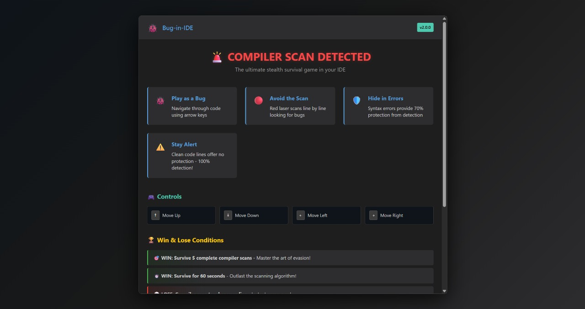
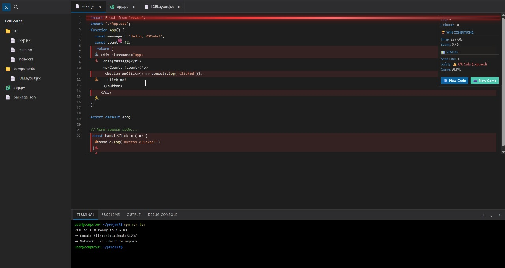
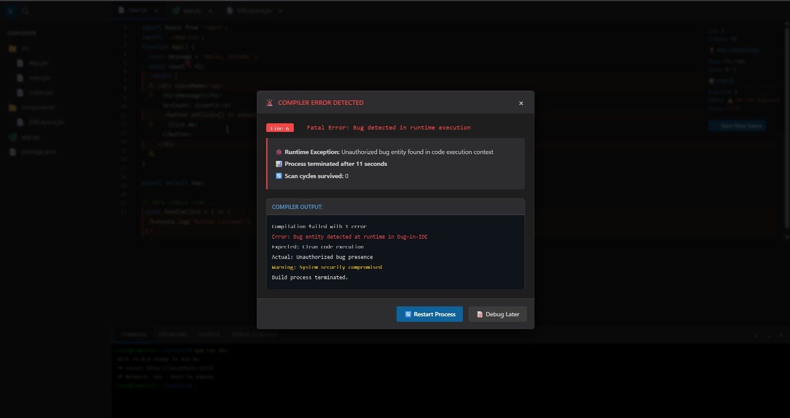

# BUG-IN-IDE 🎯

## Basic Details
### Team Name: Enthua😭

### Team Members
- Team Lead: GAYATHRI M - SCMS SCHOOL OF ENGINEERING AND TECHNOLOGY
- Member 2: C.R.Vasudev Varma - SCMS SCHOOL OF ENGINEERING AND TECHNOLOGY

### Project Description
Bug in IDE is a fast-paced browser game where players scan lines of code to locate a hidden bug while avoiding decoy errors.
The backend (FastAPI) dynamically serves fake code snippets, tracks scans, survival time, and win/lose status entirely in memory.
Players can escape through a mysterious “exit portal” revealed only if they survive long enough or spot the bug.

### The Problem (that doesn't exist)
Developers everywhere are in constant peril — not from real bugs, but from imaginary, code-crashing gremlins hiding in their IDEs.
These elusive pests can only be defeated by frantically scanning random lines of code before your sanity (and coffee supply) runs out.
Until now, there’s been no structured way to gamify this absolutely fake but totally urgent battle.
### The Solution (that nobody asked for)
We built Bug in IDE — a high-stakes, zero-stakes game where you hunt down a mischievous bug hidden deep inside fake code snippets.
Armed with a glitchy compiler scanner and questionable intuition, you’ll probe suspicious lines until you either squash the bug… or it escapes through a mysterious Exit Portal.
No productivity gained, no real bugs fixed — just pure, pointless debugging glory.

## Technical Details
### Technologies/Components Used
For Software:
Languages used: Python, JavaScript, JSON, HTML, CSS

Frameworks used: FastAPI, React (Vite)

Libraries used: Uvicorn (server), Pydantic (data validation)

Tools used: VS Code, Git, npm, pip

### Implementation
For Software:
The game is built with React (frontend) and FastAPI (backend).

Frontend: Simulates a VSCode-like IDE with moving code lines, a keyboard-controlled bug, scanning laser, hiding in syntax errors, and a random Stack Overflow escape portal.

Backend: Generates fake code with random errors, handles scan detection logic, manages portal events, and tracks scores in memory.

Game Loop: Player dodges compiler scans, hides in broken code, and reaches the portal to win — all while survival time and stats are updated in real time.

# Installation

git clone https://github.com/yourusername/bug-in-ide.git
cd bug-in-ide

cd frontend
npm install

cd ../backend
pip install -r requirements.txt

uvicorn main:app --reload

cd ../frontend
npm run dev

# Run

uvicorn main:app --reload

npm run dev

### Project Documentation
For Software:
Bug in IDE is a browser-based mini-game where you play as a bug hiding inside a fake IDE environment. Your goal is to blend in with syntax errors, avoid the moving compiler scan line, and find the escape portal before being detected. The game combines code-themed visuals with stealth mechanics to create a unique developer-style challenge.

Objective:

Hide within lines of fake code and blend with syntax errors.

Avoid the horizontal compiler scan that sweeps across the code.

Reach the escape portal to win the game.

Installation:
Frontend — Navigate to the frontend folder, install dependencies, and start the development server.
Backend — Navigate to the backend folder, install requirements, and run the FastAPI server.

Run:
Frontend runs on localhost:5173 by default. Backend runs on localhost:8000.

Controls:
Move the bug using W, A, S, D or arrow keys to navigate through the code editor.

Gameplay:
Survive as long as possible while the compiler scan moves line by line. Use syntax errors and cluttered code as hiding spots. Time your movements to avoid detection and find the randomly spawning escape portal.

# Screenshots (Add at least 3)

*Professional IDE-themed start screen with game instructions, controls explanation, and the iconic "START DEBUGGING SESSION" button that welcomes players to the bug hunting experience*

*Live gameplay showing the bug character (🐞) hiding among code lines while the red compiler scan laser moves through the editor. Notice the syntax error indicators (🚨) that provide safe hiding spots*

*Complete game interface featuring the HUD with win conditions tracker, survival statistics, and control buttons. Shows the realistic IDE layout with line numbers and syntax highlighting*

## Team Contributions
- GAYATHRI M: IDE UI and Bug Character
- C.R VASUDEV VARMA: Bug Traversal and Compiler Scanner

---
Made with ❤️ at TinkerHub Useless Projects 

